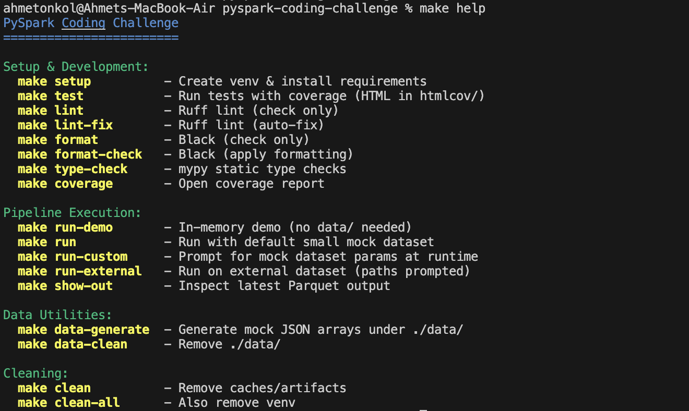

# PySpark Training-Input Pipeline

Goal of this project was to produce GPU-friendly training inputs for a transformer that learns from daily `impressions` and a user's most-recent action history (clicks, add-to-carts, orders).

---

## Table of Contents

- [0) Spec Compliance Checklist](#0-spec-compliance-checklist)
- [1) Brief Problem Overview](#1-brief-problem-overview)
- [2) What I Built (High-Level)](#2-what-i-built-high-level)
- [3) Data Model & Canonical Schemas](#3-data-model--canonical-schemas)
- [4) Pipeline Architecture](#4-pipeline-architecture)
  - [4.1) `actions_union`](#41-actions_union)
  - [4.2) `history_builder`](#42-history_builder)
  - [4.3) `training_examples`](#43-training_examples)
  - [4.4) `pipeline.build_training_inputs`](#44-pipelinebuild_training_inputs)
- [5) Running the Pipeline](#5-running-the-pipeline)
  - [5.1) Modes](#51-modes)
  - [5.2) CLI Examples](#52-cli-examples)
  - [5.3) Makefile Shortcuts](#53-makefile-shortcuts)
  - [5.4) Usage Demos](#54-usage-demos)
- [6) Output Format (for Training)](#6-output-format-for-training)
- [7) Proposed Training Plan (PyTorch, High-Level)](#7-proposed-training-plan-pytorch-high-level)
- [8) Performance Considerations](#8-performance-considerations)
- [9) Data Quality & Correctness Guarantees](#9-data-quality--correctness-guarantees)
- [10) Tests & Tooling](#10-tests--tooling)
  - [10.1) Test & Coverage](#101-test--coverage)
  - [10.2) Commands Quick Reference](#102-commands-quick-reference)
  - [10.3) Environment](#103-environment)
- [11) Repository / Folder Structure](#11-repository--folder-structure)
- [12) Assumptions & Limitations](#12-assumptions--limitations)
- [13) Next Steps](#13-next-steps)
- [Tunable Knobs](#tunable-knobs)
- [Submission](#submission)

> Note: Sections **0-5** are the high-level summary requested; later sections add implementation details and demos.

---

## 0) Spec Compliance Checklist

This section maps the requirements to what exists in this repo.

- **Pipelines accept & return DataFrames**: `actions_union → history_builder → training_examples → pipeline.build_training_inputs` all take Spark DataFrames and return DataFrames so external data sources can be plugged in easily.
- **History windowing & look-back**: Per impression, we build customer action history with a **365-day** look-back; keep the **last 1,000** actions; strictly `occurred_at < as_of_date` to prevent same-day leakage.
- **Ordering & padding**: Histories are sorted by `occurred_at DESC` (ties by `action_type`, `item_id`) and padded to a fixed length with **0**. Missing `action_type` = **0**.
- **Action type coding**: `1 = click`, `2 = add_to_cart`, `3 = order`, `0 = missing`.
- **Training horizon**: default impression window of **14 days** to keep artifacts small while matching the expected training setup.
- **Duplicates**: preserved by default (no dedup), matching the specification note.
- **Output shape**: final DF contains fixed-length arrays suitable for GPU training (static shapes for batching).
- **Performance**: partitioning by `customer_id`, projecting early, and partitioned writes by `as_of_date`.
- **Tests**: local `pytest` suite with coverage (HTML at `htmlcov/index.html`).
- **Data Quality**: invariant checks for leak guard, bounded history length, and deterministic ordering.

---

## 1) Brief Problem Overview

We need to construct training inputs for a transformer model that predicts user engagement on a daily "Our choices for you" carousel:

* **Inputs**:

  * Daily **impressions** per `(as_of_date, customer_id, ranking_id)`; each impression row contains an array of `item_id` plus `is_order` label for that item.
  * Historical **user actions**: clicks, add-to-carts (ATC), and previous orders.
* **History window per day**: For every day a user has impressions, we must attach their **most recent 1,000 actions** from **strictly before** that day (no same-day actions), looking back up to **365 days**.
* **Training shape**: the model will consume, per training example (impression-item), a single `item_id`, the fixed-length `actions` array (length 1,000), and `action_types` (parallel array; 1=click, 2=atc, 3=order, 0=pad).

This repository contains an end-to-end PySpark solution that accepts **DataFrames** as inputs and writes the **training inputs** in a GPU-friendly layout, plus scripts, tests, and a Makefile to run everything locally.

---

## 2) What I Built (High-Level)

* A **modular PySpark pipeline** with small, testable components:

  * `actions_union`: normalizes clicks/ATC/orders into one canonical action stream.
  * `history_builder`: constructs **fixed-length** (1,000) action histories per `(as_of_date, customer_id)` with correct filters and ordering.
  * `training_examples`: joins histories back to impressions; optionally **explodes** impression arrays so each training row is one `(impression_item_id, is_order, actions, action_types)` sample.
  * `pipeline.build_training_inputs`: the orchestration function that wires everything together and returns a DataFrame.
* **Operational scripts**:

  * `scripts/run.py`: one entrypoint supporting **DEMO**, **LOCAL mock-data**, and **EXTERNAL paths** modes; writes partitioned Parquet.
  * `scripts/generate_mock_data.py`: produces realistic JSON arrays for impressions/clicks/atc/orders.
  * `scripts/show_output.py`: pretty-prints recent outputs and samples exploded impressions for quick inspection.
* **Quality gates**: strict **same-day-leak prevention** checks, schema normalization, and optional quarantine for malformed records.
* **Comprehensive tests** with `pytest` (unit + lightweight integration), `pytest-cov` for coverage, and a `Makefile` for local DX.

---

## 3) Data Model & Canonical Schemas

*All schemas live in `src/challenge/schemas.py` (typed with PySpark Types).*

### Raw inputs

* **Impressions**: `dt: str`, `ranking_id: str`, `customer_id: bigint`, `impressions: array<struct<item_id:int,is_order:boolean>>`
* **Clicks**: `dt: str`, `customer_id: bigint`, `item_id: int`, `click_time: timestamp`
* **Add-to-Carts (ATC)**: `dt: str`, `customer_id: bigint`, `config_id: int`, `simple_id: int`, `occur_at: timestamp`
* **Previous Orders**: `order_date: date`, `customer_id: bigint`, `config_id: int`

### Canonical action stream (output of `actions_union`)

`customer_id: bigint`, `item_id: int`, `action_type: int` (1=click, 2=atc, 3=order), `occurred_at: timestamp`, `action_date: date`, `source: string`

### Final training output (non-exploded)

`ranking_id, customer_id, impressions (array<struct<item_id,is_order>>), actions (array<int>[1000]), action_types (array<int>[1000]), as_of_date: date`

> There is also an **exploded** form where each row is a single impression-item: `impression_item_id, is_order, actions, action_types, as_of_date, ranking_id, customer_id`.

---

## 4) Pipeline Architecture

All transformations accept **DataFrames** so reviewers can plug in their own sources without code changes.

### 4.1) `actions_union`

**File**: `src/challenge/actions_union.py`  
Unifies clicks/ATC/orders to the canonical schema via `select`/`cast`, adds `occurred_at` consistently (for orders we use midnight), and derives `action_date`. This enables deterministic **ordering** and efficient **date filters** later.

### 4.2) `history_builder`

**File**: `src/challenge/history_builder.py`  
Builds **per-(as_of_date, customer_id)** histories with the **last N=1000 actions** inside a **365-day lookback**, **strictly before** `as_of_date`. Ordering is:

1. `occurred_at` **DESC** (most recent first),
2. `action_type` **DESC** (tie-break),
3. `item_id` **DESC** (final tie-break).

Histories are right-padded with `0` (both `actions` and `action_types`) when the user has fewer than 1000 actions.

### 4.3) `training_examples`

**File**: `src/challenge/training_examples.py`

* Joins normalized impressions with histories on `(as_of_date, customer_id)`.
* Provides two shapes: **non-exploded** (one row per impression row) and **exploded** (one row per impression-item).

### 4.4) `pipeline.build_training_inputs`

**File**: `src/challenge/pipeline.py`  
Top-level assembly that calls the above modules, including minor **performance** choices:

* Repartitioning by `customer_id` / `as_of_date` prior to windowing.
* Writing outputs partitioned by `as_of_date` for better downstream IO.

---

## 5) Running the Pipeline

### 5.1) Modes

* **DEMO**: In-memory synthetic DFs; no files required.
* **LOCAL**: Load JSON arrays from `./data/*` (write some with `scripts/generate_mock_data.py`).
* **EXTERNAL**: Provide paths/patterns for impressions/clicks/atc/orders (JSON or Parquet). Malformed rows are quarantined under the output folder.

### 5.2) CLI Examples

> Use a virtualenv first (see Makefile).

**Demo (fastest):**

```bash
python scripts/run.py --demo --out out/training_inputs
```

**Local mock data (generate → run):**

```bash
python scripts/generate_mock_data.py --base data --days 30 --customers 50 --items 500 --batch-size 200
python scripts/run.py --out out/training_inputs --max-actions 1000 --lookback-days 365
```

**External files:**

```bash
python scripts/run.py \
  --impressions-path "s3a://…/impressions/*" \
  --clicks-path "s3a://…/clicks/*" \
  --atc-path "s3a://…/atc/*" \
  --orders-path "s3a://…/orders/*" \
  --out "s3a://…/training_inputs" \
  --train-days 14 \
  --max-actions 1000 \
  --lookback-days 365 \
  --fail-on-same-day-leak
```

> Use `--explode` if you want one row per impression-item.

**Quarantine example (EXTERNAL mode):** malformed JSON is written under the run folder, for example:  
`out/training_inputs/2025_08_17_12_00_00/_quarantine_impressions/*.json`

> **Local resources:** If your laptop is memory-constrained, set `SPARK_DRIVER_MEMORY=4g` before running, or reduce `--max-actions` / `--train-days`.

### 5.3) Makefile Shortcuts

**Setup & Development**

```bash
make setup         # Create venv & install requirements
make test          # Run tests with coverage (HTML in htmlcov/)
make lint          # Ruff lint (check only)
make lint-fix      # Ruff lint (auto-fix)
make format        # Black (check only)
make format-check  # Black (apply formatting)
make type-check    # mypy static type checks
make coverage      # Open coverage report
```

**Pipeline Execution**

```bash
make run-demo      # In-memory demo (no data/ needed)
make run           # Run with default small mock dataset
make run-custom    # Prompt for mock dataset params at runtime
make run-external  # Run on external dataset (paths prompted)
make show-out      # Inspect latest Parquet output
```

**Data Utilities**

```bash
make data-generate # Generate mock JSON arrays under ./data/
make data-clean    # Remove ./data/
```

**Cleaning**

```bash
make clean         # Remove caches/artifacts
make clean-all     # Also remove venv
```
### 5.4) Usage Demos

> **Before you run any demos, do:** `make setup` (creates venv & installs deps).
>
> The first `make run` on a fresh machine is slower because Python deps are installed, the Spark session warms up JIT/IO caches, and the `~/.ivy2` / `~/.cache` layers populate. Subsequent runs are much faster.

**`make help` (quick command reference):**  



**Quick start order:**
1. `make setup`
2. `make run` (or `make run-demo`)
3. `make show-out`
4. `make test` (optional)

**`make run` (default small mock dataset):**

- First-ever run will show longer **Spark session setup**; later runs drop several seconds.
- This run also prints a strict DQ line proving **no same-day leakage** when data is clean.


**`make run-demo` (in-memory synthetic inputs):**


**`make run-custom` (interactive mock params):**


**`make run-external` (provide real dataset paths):**  
If your provided dataset contains at least one same-day action relative to an impression day, the DQ check will warn:


**`make show-out` (inspect latest Parquet for schema & samples):**


---

## 6) Output Format (for Training)

**Non-exploded row** (one row per impression record):

```text
ranking_id | customer_id | impressions[array<struct<item_id,is_order>>] | actions[1000]int | action_types[1000]int | as_of_date
```

**Exploded row** (one row per item in the impressions array):

```text
as_of_date | ranking_id | customer_id | impression_item_id:int | is_order:boolean | actions[1000]int | action_types[1000]int
```

**Sample (exploded) JSON-ish row:**

```json
{
  "as_of_date": "2025-08-16",
  "ranking_id": "r1",
  "customer_id": 101,
  "impression_item_id": 12345,
  "is_order": false,
  "actions": [987, 654, 321, 0, 0],
  "action_types": [1, 2, 3, 0, 0]
}
```

Outputs are written as **Parquet**, partitioned by `as_of_date` for efficient day-based sampling during training.

---

## 7) Proposed Training Plan (PyTorch, High-Level)

Although this repo doesn't include PyTorch code, here's how I would wire the data in a production trainer:

1. **Data loading & sharding**

   * Load **14 days** of Parquet. For each day, **explode** the impressions so a **training example = one impression-item**.
   * Shard by `as_of_date` across workers; within a day, **randomly sample** (uniform) across all impression-items of that day.

2. **Feature mapping**

   * Map `impression_item_id` and `actions` (item IDs) -> **embedding indices** via a shared `nn.Embedding` (or ID-to-index dictionary produced offline).
   * Keep `action_types` as integer features (values: 0,1,2,3).

3. **Batching**

   * Collate into three tensors per batch:  
     * `impressions`: shape `[batch]` — one item_id per example.  
     * `actions`: shape `[batch, 1000]` — right-padded with 0s (already in data).  
     * `action_types`: shape `[batch, 1000]` — parallel to `actions`.
   * Enable `pin_memory=True` in DataLoader; prefer contiguous arrays for zero-copy HtoD on a single large GPU.

4. **Sampling within a day**

   * For each epoch, iterate day by day; **reshuffle** the per-day order each epoch. 
   * (Optional) Curriculum: start with shorter histories (<1k) then ramp up, if needed for faster warm-up.

5. **Targets / loss**

   * From `is_order` for each impression-item; use a suitable classification loss (e.g., BCE with logits or softmax if ranking).

6. **Throughput tips**

   * Cache per-day Parquet in a local NVMe or distributed cache.
   * Vectorize embedding lookups; fuse small ops; avoid Python-side loops.

This plan keeps the GPU busy by minimizing on-the-fly Spark work during training — all heavy joins/windowing are done **once** in this pipeline.

---

## 8) Performance Considerations

* **Schema-first normalization**: Reduce runtime casts & ambiguous types early.
* **Pre-partitioning**: `actions_union` and impression contexts are **repartitioned by `customer_id` / `as_of_date`** before window operations to cut shuffle skew.
* **Strict pre-filters**: Apply `lookback_days` and `occurred_at < as_of_date` **before** windowing to minimize row counts.
* **Fixed-length arrays**: `pad_array` produces ready-to-feed `[1000]` arrays (no padding at train time).
* **Columnar IO**: Parquet + partitioning by `as_of_date` improves downstream slicing (by day) and enables predicate push-down.
* **Small, composable transforms**: Easier to reason about and test; also helps with adaptive query execution in Spark 3/4.

---

## 9) Data Quality & Correctness Guarantees

* **No same-day leakage**: histories include only actions **strictly before** `as_of_date` (pipeline filters and a separate strict DQ check in `scripts/run.py`).
* **Optional upstream input scan**: pass `--external-upstream-scan` to surface if inputs contain same-day actions (informational; histories remain clean).
* **Window size & padding**: exactly **last 1000** actions if available; otherwise right-pad with zeros for both arrays.
* **Duplicates allowed**: we do **not** drop duplicates; repeated actions are informative.
* **Quarantine for malformed rows**: when reading **EXTERNAL** inputs, any corrupt JSON is written to `_quarantine_*` subfolders under the output dir.
* **Unit tests** cover: unioning actions, date filters, history ordering, padding behavior, impression normalization, IO read/write helpers, CLI integration, and output viewing helpers.

> To **fail fast** on strict leaks, run with `--fail-on-same-day-leak`. To only surface upstream same-day actions without failing the run, add `--external-upstream-scan` (histories remain clean either way).

---

## 10) Tests & Tooling

### 10.1) Test & Coverage

#### Test Run


#### Coverage


### 10.2) Commands Quick Reference

```bash
make test       # runs pytest with coverage (HTML at htmlcov/index.html)
make coverage   # optional alias to print/open coverage
```

### 10.3) Environment

- **Python**: 3.9.x (tested)
- **PySpark**: 4.0.0
- **Java**: 11 or 17 recommended
- **OS used**: macOS 14.x (should be OS-agnostic)
- **Timezone assumption**: UTC for all timestamps

---
* **Run tests**: `make test` (HTML coverage in `htmlcov/index.html`).
* **Linters/formatters**: `ruff`, `black`, `mypy`.
* **PySpark**: `pyspark==4.0.0` (see `requirements.txt`).

Notable tests (see `tests/`):

* `test_actions_union.py`
* `test_impressions.py`
* `test_history_builder.py`
* `test_training_examples.py`
* `test_io.py`
* `test_run.py` (script integration)
* `test_scripts_show_output.py`
* `test_generate_mock_data.py`

---

## 11) Repository / Folder Structure

```
pyspark-coding-challenge/
├─ src/challenge/
│  ├─ actions_union.py          # normalize & union clicks/atc/orders
│  ├─ history_builder.py        # windowed histories per (as_of_date, customer)
│  ├─ impressions.py            # normalize & explode helpers
│  ├─ training_examples.py      # join histories back to impressions (explode opt.)
│  ├─ pipeline.py               # orchestrates everything; returns a DataFrame
│  ├─ io.py                     # read/write helpers, quarantine support
│  ├─ schemas.py                # canonical schemas
│  ├─ utils.py                  # padding helpers, action type constants
│  └─ quality_checks.py         # DQ checks (e.g., same-day leak detector)
├─ scripts/
│  ├─ run.py                    # main entry; DEMO/LOCAL/EXTERNAL modes
│  ├─ generate_mock_data.py     # synth data generator
│  └─ show_output.py            # convenience viewer for recent outputs
├─ tests/                       # pytest suite
├─ data/                        # (optional) local mock data goes here
├─ out/                         # (generated) parquet outputs (partitioned)
├─ Makefile                     # happy-path dev workflows
└─ requirements.txt
```

---

## 12) Assumptions & Limitations

* If orders lack per-event timestamps, I normalize them to **midnight** of `order_date` so day math remains correct.
* I do **not** use `simple_id` for ATC in the model input; it could be joined later if a size-level embedding is needed.
* I keep **duplicates** in action history by design.
* For extreme user skew, **additional salting** / **AQE** strategies may be added in a cluster setting.

---

## 13) Next Steps

* Plug in real Kafka/S3 sources and production schemas.
* Add optional **dedup variants** (e.g., drop consecutive duplicates) behind a flag for ablation studies.
* Extend DQ to check **time monotonicity** and **cross-table consistency**.
* Provide a reference PyTorch `DataLoader` and simple baseline model script.

---

## Tunable Knobs

| Knob                       | Where                      | Default | Description                                                         |
| -------------------------- | -------------------------- | ------- | ------------------------------------------------------------------- |
| `--train-days`             | `scripts/run.py`           | 14      | Keep only the last N days of impressions for a training run         |
| `--max-actions`            | `history_builder.py` / CLI | 1000    | Fixed history length                                                |
| `--lookback-days`          | `history_builder.py` / CLI | 365     | Max history window per `(day, user)`                                |
| `--explode`                | `scripts/run.py`           | off     | Emit one row per impression-item                                    |
| `--fail-on-same-day-leak`  | `scripts/run.py`           | off     | Exit non-zero if any same-day action leaks into histories           |
| `--external-upstream-scan` | `scripts/run.py`           | off     | Surface presence of same-day actions in inputs (informational only) |
| `--shuffle-partitions`     | `scripts/run.py`           | 0       | Override `spark.sql.shuffle.partitions` if needed                   |

---

## Submission
- Public repo name: **pyspark-coding-challenge**  
- What to review first: sections **0-5** in this README, then `tests/`  
- Quick run:
  1) `make setup`
  2) `make run-demo`
  3) `make show-out`
  4) `make test`


